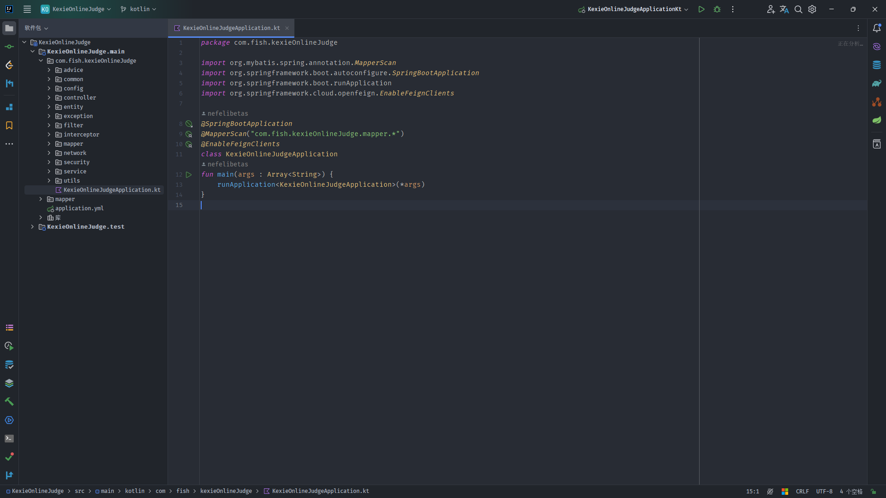

# 
 KexieOnlineJudger 😆

## 📓 简介

一个简单(😇)的OJ后端，由kotlin语言开发，构建工具选用Gradle 8.4(下次打死也不用😅)。

技术栈：

* 基本后端框架：SpringBoot 3.1.6
  * web
  * data-redis
  * security
  * validation
  * json
* API文档生成： springdoc
* JWT：jjwt-0.12.3
* ORM：Mybatis-flex
* OpenFeign：基于RestTemplate的Http请求库

预期开发于取代原先社团使用的oj系统，这里是业务后端，代码运行的沙箱环境见：[sb-judger - 使用 Go 语言开发的轻量 OnlineJudge Server.](https://github.com/msqtt/sb-judger?tab=readme-ov-file) 

## 🚀 开始

### 🔧 安装

1. 下载代码

~~~bash
git clone https://github.com/nefelibetas/KexieOnlineJudge
~~~

2. 导入idea

3. 修改配置文件

`修改关于数据库、日志文件导出的配置`

## 🛠 API

* 用户相关功能
  * 登录 √
  * 注册 √
  * 修改个人信息（不包括密码） √
  * 切换用户状态（是否启用） √
  * 获取用户 
    * 管理员 √
    * 普通用户 √
  * 修改密码 √
* 栏目相关
  * 创建栏目 √
    * 支持在创建时添加题目
  * 添加题目到栏目中 √
  * 移除栏目中的题目 √
  * 获取栏目信息（包括其中的题目） √
  * 获取栏目可添加的的题目  √
  * 切换栏目状态（是否启用） √
  * 删除栏目 √
  * 获取栏目
    * 全部（分页） √
    * 特定 √
  * 模糊查询 √
* 题目相关
  * 添加题目 √
    * 支持在添加时添加标签、样例
  * 删除题目 (不建议做，涉及表太多)
  * 禁用、启用题目 √
  * 获取题目可选的标签  √
  * 修改题目信息 √
  * 获取题目信息
    * 特定 √
    * 全部（分页） √
  * 模糊查询 √
* 标签相关
  * 新增 
    * 批量 √
    * 单个 √
  * 删除 √
  * 修改 √
  * 获取
    * 批量 √
    * 特定 √
  * 模糊查询 √
* 样例相关
  * 批量添加样例 √
  * 更新样例信息 √
  * **暂时不做删除，会涉及到很多问题**
* 题解相关
  * 新增题解 √
  * 获取题解详情（带一级评论） √
  * 获取全部题解 √
  * 修改置顶状态（单置顶）√
  * 修改题解状态（禁用或启用）√
* 题解评论相关
  * 发布评论 √
  * 删除评论 √
  * 获取一级评论 √
  * 获取二级评论 √
* 题解点赞相关
  * 点赞和取消题解 √
  * 点赞和取消评论 √
* 测评相关
  * 试运行代码 √
  * 判题 √
* 考试相关
  * 查询全部试卷 √
  * 查询特定试卷 √
  * 添加试卷 √
  * 修改试卷 √
  * 修改试卷状态 √
* 消息相关
  * 添加消息 
    * 公告 √
    * 通知 √
  * 修改通知阅读状态
    * 单个 √
    * 批量 x
  * 获取未读通知数量 √
